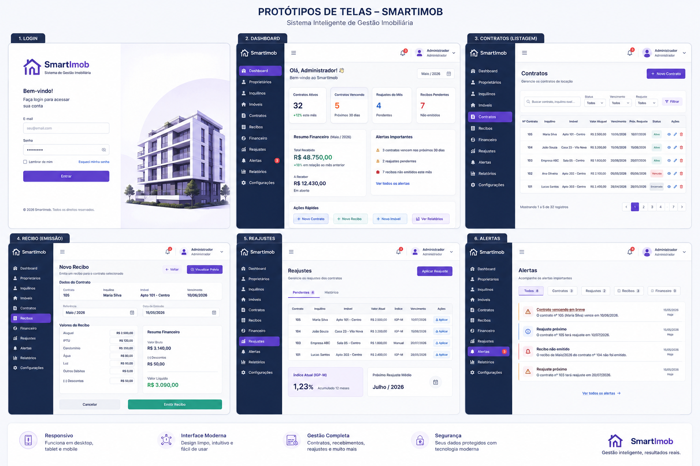
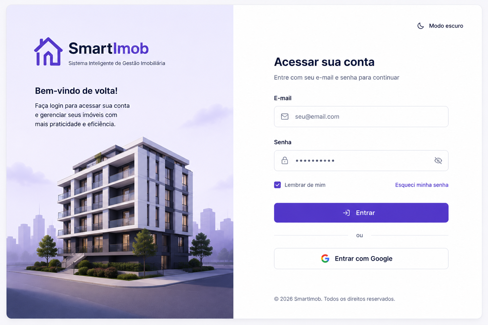
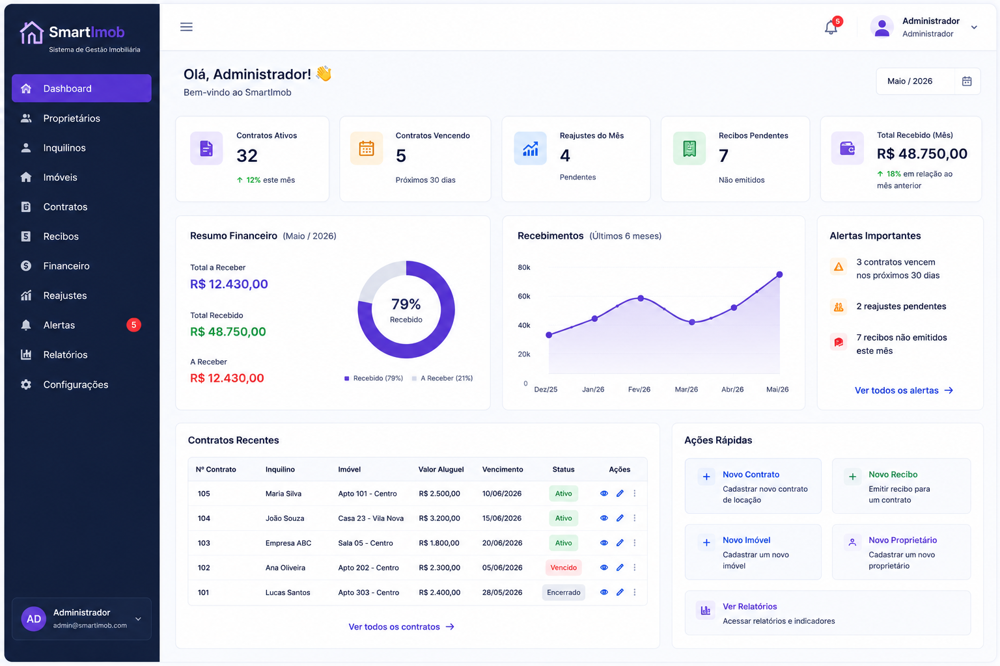
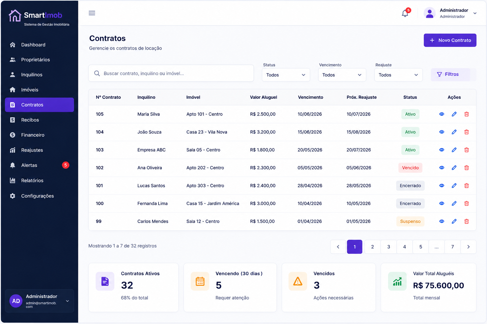
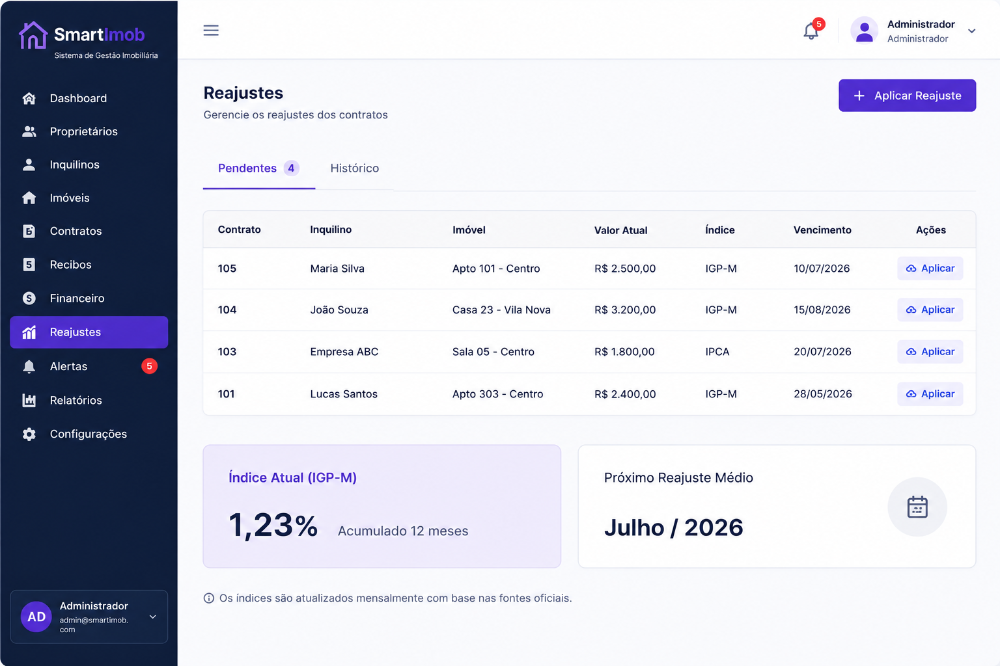
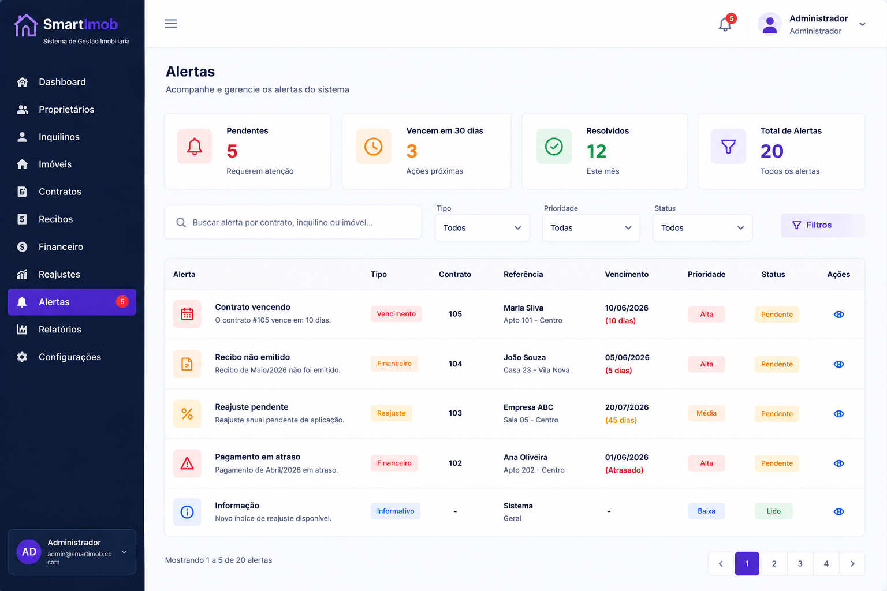
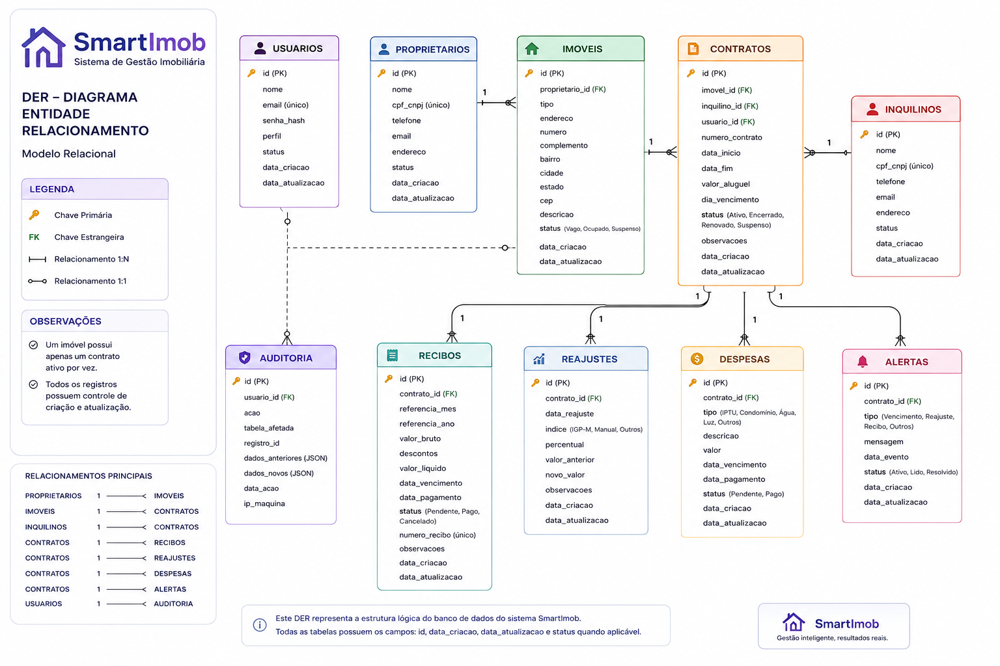

# SmartImob — Plataforma Inteligente de Gestão Imobiliária

## Sobre o Projeto

O SmartImob é um sistema web desenvolvido para auxiliar imobiliárias na gestão operacional de contratos, recibos, reajustes e controle financeiro básico.

O projeto foi estruturado com foco em:
- organização contratual;
- automação operacional;
- controle de vencimentos;
- emissão de recibos;
- gestão financeira simplificada.

---

## Objetivo

Centralizar e simplificar a gestão imobiliária através de uma plataforma moderna, organizada e escalável.

---

## 🚧 Status do Projeto

Atualmente em fase de desenvolvimento da aplicação.

---

## 📌 Roadmap

- [x] Levantamento de requisitos
- [x] Documentação funcional
- [x] Modelagem de banco
- [x] Protótipos
- [x] DER
- [ ] Desenvolvimento Front-end
- [ ] Desenvolvimento Back-end
- [ ] Testes
- [ ] Deploy

---

## Funcionalidades do MVP

- Login e autenticação
- Cadastro de proprietários
- Cadastro de inquilinos
- Cadastro de imóveis
- Gestão de contratos
- Emissão de recibos
- Controle de reajustes
- Dashboard operacional
- Alertas automáticos

---

## 🎨 Protótipos do Sistema

### Protótipos Geral

---

### Login

---

### Dashboard

---

### Gestão de Contratos

---

### Reajustes

---

### Alertas

---

## 🗄️ DER — Banco de Dados

---

## 📄 Documentação Oficial

| Documento | Acesso |
|---|---|
| Documentação Completa | [Abrir PDF](docs/pdf/smartimob-documentacao-completa.pdf) |
| Requisitos Funcionais | [Abrir PDF](docs/pdf/requisitos-funcionais.pdf) |
| Regras de Negócio | [Abrir PDF](docs/pdf/regras-de-negocio.pdf) |
| Requisitos Não Funcionais | [Abrir PDF](docs/pdf/requisitos-nao-funcionais.pdf) |
| Fluxo de Telas | [Abrir PDF](docs/pdf/fluxo-de-telas.pdf) |
| Estrutura Visual | [Abrir PDF](docs/pdf/estrutura-visual-das-telas.pdf) |
| MVP | [Abrir PDF](docs/pdf/mvp.pdf) |
| Banco de Dados | [Abrir PDF](docs/pdf/banco-de-dados.pdf) |

---

## Tecnologias Sugeridas

### Front-end
- React
- Next.js

### Back-end
- Node.js

### Banco de Dados
- PostgreSQL

---

## 👥 Equipe do Projeto

### Gestão do Produto e Documentação
Angelica Viana da Paixão

Responsável por:
- levantamento de requisitos;
- regras de negócio;
- documentação funcional;
- MVP;
- modelagem relacional;
- protótipos;
- planejamento do sistema.

---

### Desenvolvimento da Aplicação
Romilton Viana da Paixão

Responsável por:
- arquitetura do sistema;
- desenvolvimento front-end;
- desenvolvimento back-end;
- implementação técnica;
- banco de dados.

---

